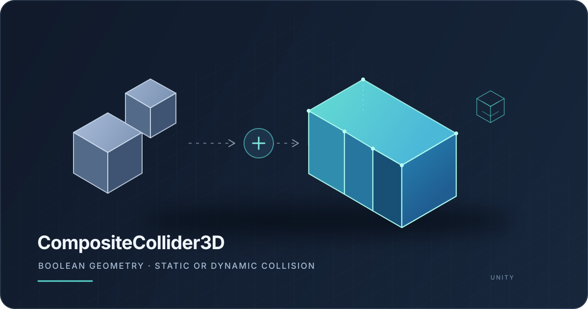

# CompositeCollider3D

Combine closed 3D Collider shapes with Boolean operations and use the result as a static or dynamic collision shape.

[日本語版 README](README.ja.md)

## Install

1. Open **Window > Package Manager**.
2. Select **+ > Add package from git URL**.
3. Enter the following URL:

   `https://github.com/seikasan/CompositeCollider3D.git?path=/Packages/com.seikasan.composite-collider-3d`

## Usage

1. Add `CompositeCollider3D` to a GameObject and assign at least two Colliders to **Sources**. Use **Use Child Colliders** to fill the list from child objects.
2. A source Collider uses **Merge** by default. Add `CompositeColliderSource3D` to the same GameObject as a source Collider to choose **Difference** or **Intersect**.
3. Choose **Static Concave** or **Dynamic Convex**, then click **Generate Geometry**. Dynamic mode creates one Rigidbody and a set of convex MeshColliders.
4. Assign a Physics Material or Layer Overrides on `CompositeCollider3D` if needed. Save generated meshes with **Save Generated Meshes...** to keep them as project assets.

The first source starts the result, so its Boolean operation is ignored. The remaining operations run in list order. For example, `A → Difference B → Merge C` evaluates as `(A − B) ∪ C`.

## Supported Colliders

- `MeshCollider`: must use a readable, closed mesh with consistent outward winding.
- `BoxCollider`, `SphereCollider`, and `CapsuleCollider`: converted to polygon meshes before the Boolean operation. Spheres and capsules are approximations.

Dynamic convex decomposition approximates concave geometry. Check the resulting Collider in the Scene view and test contact behavior for your use case. Static mode uses one non-convex MeshCollider and must not be used with a non-kinematic Rigidbody.

## Generation

**Generation Type** can be **Manual** or **Automatic**. Automatic regeneration checks input geometry, source operations, relative transforms, and collision representation while editing. It does not run in Play Mode or in a player build. Inspector generation runs in the background and keeps the previous result active until the new result is ready. `GenerateGeometry()` called from script runs synchronously.

For Dynamic Convex, **Advanced (CoACD)** exposes Concavity Threshold, Sample Resolution, and MCTS Iterations. Lower sample and iteration counts may reduce generation time; a higher threshold may reduce the number of parts while approximating concavities more loosely. **Generated Info** shows the last result and timing breakdown.

Keep the composite GameObject scale at `(1, 1, 1)` and place source Colliders below it in the hierarchy. After a successful generation, the source Colliders are disabled to prevent duplicate contacts.

## Platform Support

The package includes CoACD native libraries for Windows x86_64, macOS, and Linux x86_64. The bundled ManifoldNET native libraries currently support Windows x86_64 only, so Boolean generation is currently supported only on Windows x86_64.

To enable Boolean generation on other systems, add native builds of `manifoldc` that match the C API in the bundled ManifoldNET 1.0.7-alpha bindings (source commit `94bd588a03bf6c22c41c2bf2539b1c980e497b6e`):

- macOS: `libmanifoldc.dylib` for both arm64 and x86_64. A universal binary is preferred.
- Linux: `libmanifoldc.so` for x86_64.
- Include the matching runtime libraries if `manifoldc` was dynamically linked to dependencies such as oneTBB. Check macOS dependencies with `otool -L` and Linux dependencies with `ldd`.

Place the files under `Runtime/Plugins/Manifold` and configure their Unity Plugin Importer platform settings. See [Third Party Notices](Third%20Party%20Notices/THIRD-PARTY-NOTICES.txt) for bundled library information.

## About

Composite Collider 3D for Unity.
